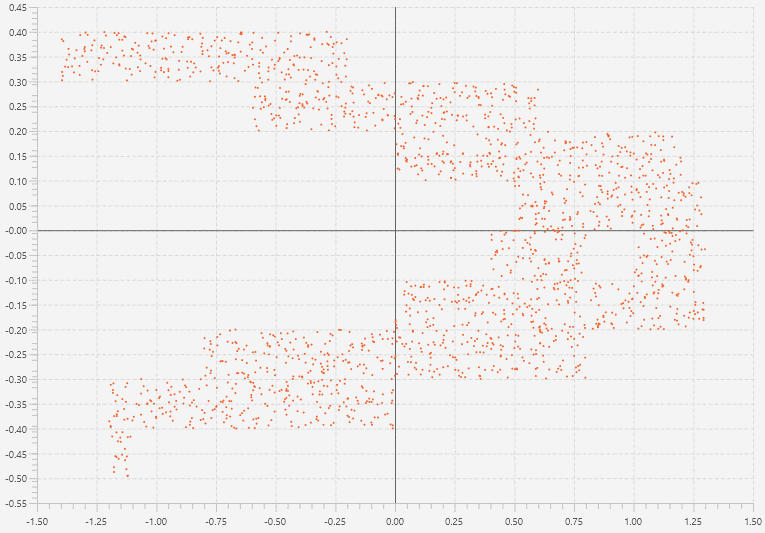

# Chart Builder Application

The major objective being followed by developing this project was to design and implement some comprehensible program for dynamic system trajectories displaying. 

Such systems are defined by a set of equations like xit = fi(xit).

The application has separate GUI tabs for various tasks. Display window displays as soon as the calculations are performed. Uses an idea of symbolic image construction described [here](https://www.math.spbu.ru/user/ampilova/book_ej.pdf).
